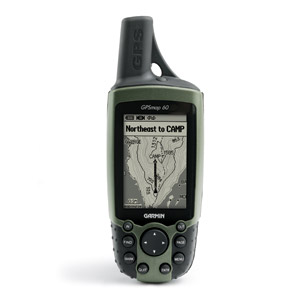

# GPSmap 60

Én egy [GPSMAP 60](http://support.garmin.com/support/sw/supportPage/display?locale=en_US&topicIDs={e0585080-030b-11dc-e9ab-000000000000}&topicIDs=Mapping%20Handhelds&topicIDs={09d30780-03d3-11dc-786a-000000000000}&topicIDs={fb3cac00-03df-11dc-786a-000000000000}) készülékkel rendelkezem, és ezzel kapcsolatos specifikus információk találhatóak itt.

Az eszköz nem támogatja a USB Mass Storage Mode-ot.

## Térképkezelés

A sendmap nálam nem működött, egyszerűen nem látta a GPS-t. A hibaüzenet:

	Cannot connect to GPS - check if cable is connected and GPS is turned ON

A térképek feltöltése a QLandkarte GT alkalmazással zökkenőmentesen működött.

## GPS adatok kezelése

A GPS adatok fel- és letöltése a GPSBabel alkalmazásból tökéletesen ment. Azonban sajnos a QLandkarte GT nem tudta az útpontokat fel- és letölteni sem. Valami kódolási probléma lehet, ugyanis a letöltésnél az útpontok nevének elejét levágta. Feltöltéskor meg sem jelentek az eszközön. Az útvonallal és nyomvonallal kapcsolatosan nem voltak problémák. Ha a GPS eszközön a geoládák vannak kiválasztva, és a GPSBabellel töltök fel újakat, azok azonnal megjelennek a GPS képernyőjén anélkül, hogy bármilyen gombot is nyomni kéne.

## Munkafolyamat

Az útvonalpontok fel- és letöltésével kapcsolatos probléma miatt a munkafolyamat kicsit bonyolultabb. Először letöltöm a Geocaching.hu-ról a ládákat, melyet betöltök a QLandkarte GT-vel. Majd megtervezem az útvonalat, és kimentem .gpx-be. Ezt a GPSBabellel töltöm fel a GPS-re. A térképet a QLandkarte GT-vel töltöm az eszközre. A túrázás után a nyomvonalat szintén GPSBabellel töltöm le (hogy az esetlegesen a GPS-en felvett pontok is helyesen jelenjenek meg), és ha kell utófeldolgozom a Qlandkarte GT-vel (pl. nyomvonal vágása). 

